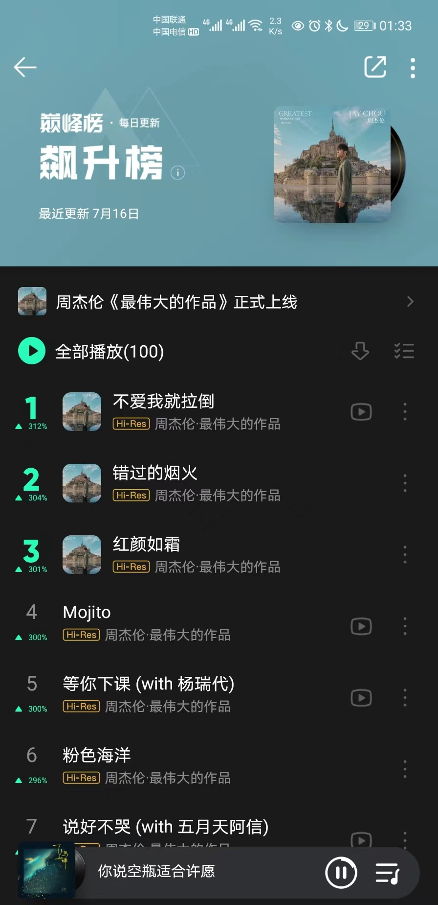
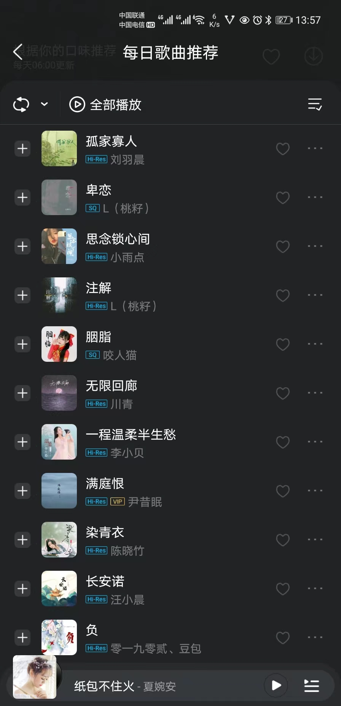
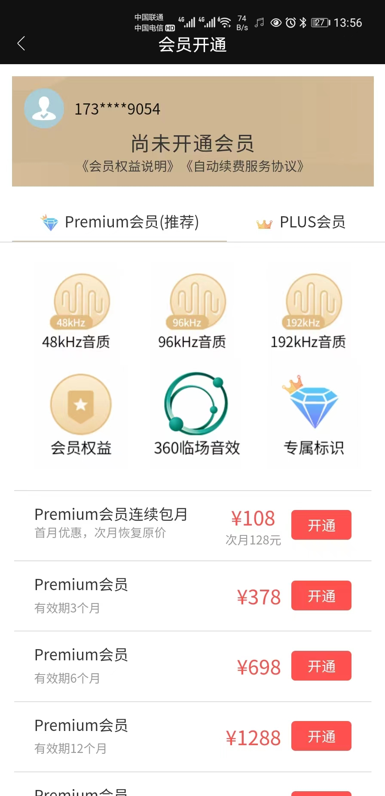
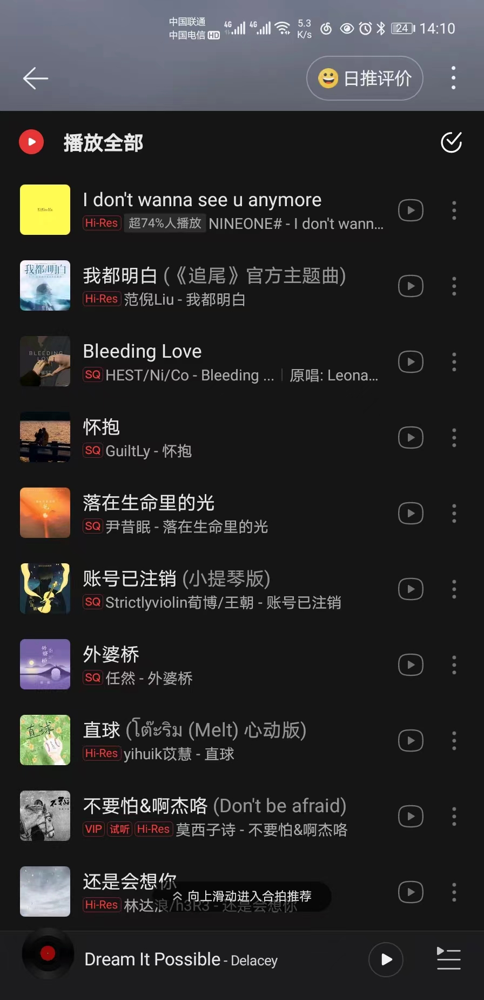
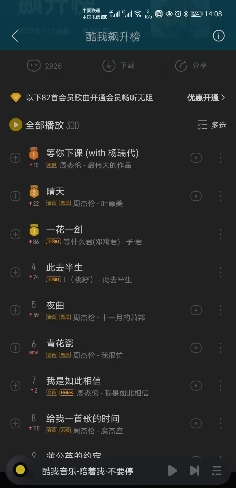
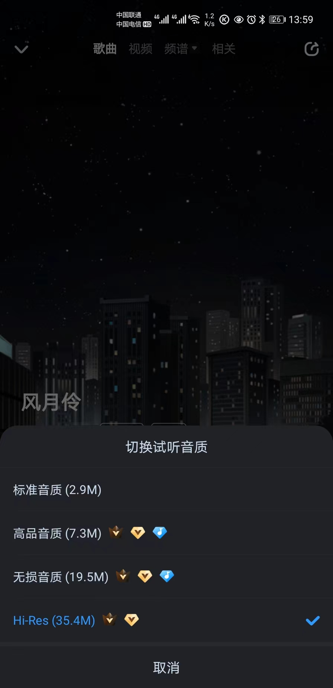

# 程序说明
## 1.说明之前先贴图几张  
### qq音乐 
### VIPER HIFI 
### 索尼精选 
### 索尼精选 
### 网易 
### 酷我 
### 酷狗 
## 2.开发背景
各大平台相继推出 Hi-Res 高标准音质 很多发现的朋友首先开个会员听听音质咋样......
耳朵灵敏的朋友哪怕是用手机和稍微好点的耳机听出来咋感觉和普通音质还是有一点区别,
先听一个月再说， 到了第二个月又得交费，连续几个月后发现好像也没听几首，
这一点还能接受就当一年少抽两包华子，但是有那么一小部分人无法忍受，
就比如我就是喜欢将更高音质的文件下来到其他更专业一点的平台播放，
平台出于对版权的维护和收益几乎都是经过加密处理，对于编程爱好者来说so easy 其他朋友吧就只能干瞪眼了，
对我而言因为本地乐库总是会有更高音质的文件更新，频繁更新呢又会引发文件总是重复的问题发生，
所以带着这两个问题及链接中文章的启发开发了这款app，[关于解锁请参考此链接](https://blog.csdn.net/r1553789169/article/details/114762884)
首先还得感谢文章作者的分享以及文中程序的开发者，非常感谢你们的分享！
## 3.功能介绍
本程序不是音乐播放器，程序主要分为两大功能，第一：酷狗、qq音乐、网易、酷我等主流平台大部分音乐文件的解密。第二：本地乐库的重复文件查找，
支持常见音乐格式文件的元数据读取，如若元数据为空的通过截取文件名的歌曲名和艺术家再写入文件的title和artist，
少部分文件尤其是mp3或者dj类文件的title和artist兼容性不是特别好，不过对于只是听音乐的你也不用担心，
不会损坏文件，建议使用之前备份文件。去除文件名中一些无意义的字符， 包括对文件名中出现如下图所示的ASCII字符进行转码：
 所以会修改文件名。
以及对文件按音质标准进行以下几种分类：(标准音质、高品音质、无损音质、Hi-Res高解析、Hi-Res母带音质、多声道文件)。
查找出的重复文件可自行选择删除或不删除，对于重复文件和相似文件统一移动至所选择的音乐根目录中。
## 4.注意事项
使用之前一定记得备份文件，本程序仅支持安卓和windows系统主流格式的文件，苹果系统的文件格式请自行尝试，
只能在windows-64bit系统下运行该程序，不兼容其他系统
  
